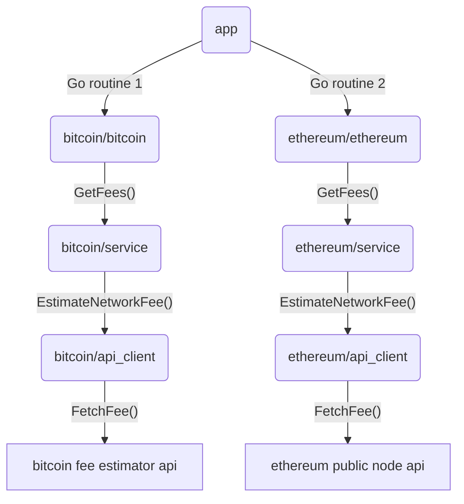

# Blockchain Fee Estimator

This is a simple tool to estimate the fee for a transaction on a blockchain. It currently supports Bitcoin.

## Usage

Using make:

```bash
make run
```

Using go:

```bash
go run cmd/fee_tracker/main.go
```

Using docker compose:

```bash
docker compose up
```

## Integrating new blockchains

To integrate a new blockchain, you need to implement the `Blockchain` interface in the `internal/blockchain/interfaces.go` file. This will require you to implement a service that can estimate the network fee for a transaction (based on the `Service` interface), and an API client that can fetch the fee data from the blockchain's API (based on the `APIClient` interface).

See the `bitcoin` package for an example.

## Current architecture

```
internal/
  blockchain/
    interfaces.go
    bitcoin/
      bitcoin.go
      service.go
      api_client.go
      constants.go
      types.go
    ethereum/
      ethereum.go
      service.go
      api_client.go
      constants.go
      types.go
    factory/
      factory.go
```

## Planned architecture (with EVM separation)

```
blockchain-fees-go
├── cmd
│   └── fee_tracker
│       └── main.go
├── internal
│   ├── app
│   │   └── app.go
│   └── blockchain
│       ├── evm
│       │   ├── interfaces.go
│       │   ├── utils.go
│       │   └── ethereum
│       │       ├── api_client.go
│       │       ├── constants.go
│       │       ├── ethereum.go
│       │       ├── service.go
│       │       ├── types.go
│       │       └── utils.go
│       ├── non_evm
│       │   └── bitcoin
│       │       ├── api_client.go
│       │       ├── bitcoin.go
│       │       ├── constants.go
│       │       ├── service.go
│       │       ├── types.go
│       │       └── utils.go
│       ├── factory
│       │   └── factory.go
│       └── interfaces.go
├── Dockerfile
├── docker-compose.yaml
├── go.mod
├── Makefile
└── README.md
```

## Architecture Flowchart



## TODOs

- [x] Add Bsc integration
- [x] Add Ethereum integration
- [x] Add Solana integration
- [x] Refactor: separate EVM and non-EVM blockchains
- [ ] Add scheduled task to fetch fees every 10 seconds
- [ ] Add Docker and Docker Compose file
- [ ] Refactor
